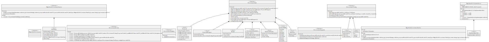
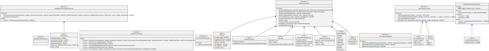
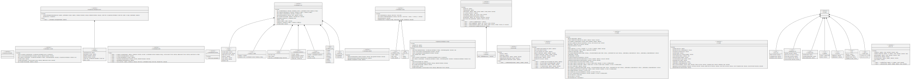

# Governance

Governance contracts include:

* deterministic governance proxy factory
* governance proxy
* governance implementation
* Rigoblock governance strategy

### Factory

<figure><figcaption></figcaption></figure>

### Proxy

<figure><figcaption></figcaption></figure>

### Implementation

<figure><figcaption></figcaption></figure>

### Rigoblock Strategy

<figure><figcaption></figcaption></figure>
