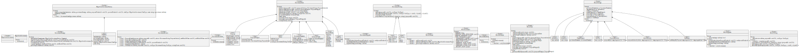

# Governance

Governance contracts include:

* deterministic governance proxy factory
* governance proxy
* governance implementation
* Rigoblock governance strategy

### Factory

<figure><figcaption>
Credits: UML diagram generated with <a href="https://github.com/naddison36/sol2uml">SOL2UML</a>
</figcaption></figure>

### Proxy

<figure><figcaption>
Credits: UML diagram generated with <a href="https://github.com/naddison36/sol2uml">SOL2UML</a>
</figcaption></figure>

### Implementation

<figure><figcaption>
Credits: UML diagram generated with <a href="https://github.com/naddison36/sol2uml">SOL2UML</a>
</figcaption></figure>

### Rigoblock Strategy

<figure><figcaption>
Credits: UML diagram generated with <a href="https://github.com/naddison36/sol2uml">SOL2UML</a>
</figcaption></figure>
