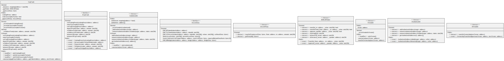

# GrgVault

The GRG vault holds the stakers' staked amount. The stake in the GRG vault is always accessible to the staker, so that even in the remote possibility of an emergency shutdown of the staking system, the staker is always able to withdraw his stake. The staked GRG, in its original design, is always in possession of the GRG vault and segregated from the staking proxy, where GRG rewards are stored.

<figure><figcaption>
Credits: UML diagram generated with <a href="https://github.com/naddison36/sol2uml">SOL2UML</a>
</figcaption></figure>
