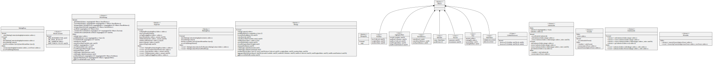

# StakingProxy

The staking proxy implements a minimal set of methods used to manage the proxy itself. All methods related to staking are implemented in the staking contract, therefore all non-implemented calls are forwarded to the staking implementation with a delegatecall. Before upgrading the implementation, the Rigoblock Governance must check that those new variables added to the staking implementation storage are placed after the existing variables and that the order of declaration is preserved, otherwise, a storage clash is possible.

<figure><figcaption>
Credits: UML diagram generated with <a href="https://github.com/naddison36/sol2uml">SOL2UML</a>
</figcaption></figure>
