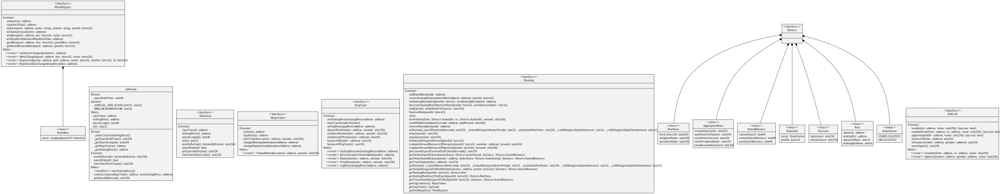

# Inflation

The inflation module allows the staking proxy to mint a maximum of 2% p.a. of GRG supply during each epoch. The inflation module, after the initial setup, cannot be upgraded.

<figure><figcaption>
Credits: UML diagram generated with <a href="https://github.com/naddison36/sol2uml">SOL2UML</a>
</figcaption></figure>
