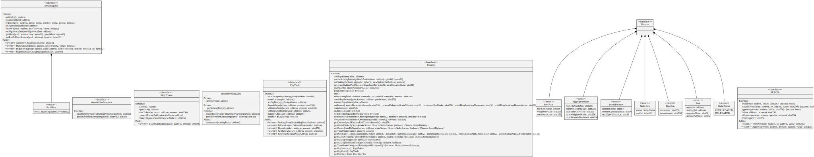

# ProofOfPerformance

The proof of performance module uses a pool's own active stake to self as a proxy for assets and performance. The higher the pool's own stake, the higher the reward credited to the staking proxy.

&#x20;Using the pool's own stake to self as a proxy for a pool's influence over the network has a number of perks, among which are gas savings and network effects. The formula may be reviewed in the future and a copy/performance fee may be applied.

In this context, GRG acts as a universal unit of measure of the different pools' tokens.

<figure><figcaption>
Credits: UML diagram generated with <a href="https://github.com/naddison36/sol2uml">SOL2UML</a>
</figcaption></figure>
