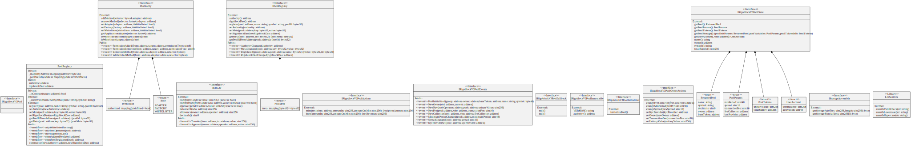

# PoolRegistry

The pool registry stores a mapping of pool address to pool ID. Furthermore, runs a sanity checks on the name and symbol string.

<figure><figcaption>
Credits: UML diagram generated with <a href="https://github.com/naddison36/sol2uml">SOL2UML</a>
</figcaption></figure>
