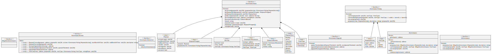

# AGovernance

Rigoblock pools can interact with the Rigoblock governance. In particular, they can:

* make a proposal
* vote on an active proposal
* execute a successful proposal

In the future, this adapter might be upgraded through governance voting to support a broader number of governance projects.

<figure><figcaption>
Credits: UML diagram generated with <a href="https://github.com/naddison36/sol2uml">SOL2UML</a>
</figcaption></figure>
