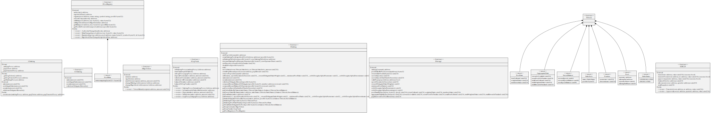

# AStaking

GRG staking is simplified for the pool operators by enabling the creation, staking and activating stake in 1 single call without having to worry about correctly formatting inputs.

<figure><figcaption>
Credits: UML diagram generated with <a href="https://github.com/naddison36/sol2uml">SOL2UML</a>
</figcaption></figure>
