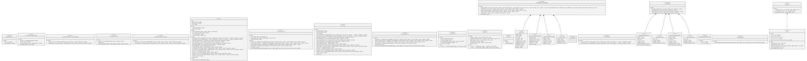

# AUniswap

Transactions to Uniswap are handled by a custom adapter, which makes some sanity checks and then sends a swap/mint/burn op to the Uniswap V2 router, which includes methods for Uniswap V3, V2, NPM.

<figure><figcaption>
Credits: UML diagram generated with <a href="https://github.com/naddison36/sol2uml">SOL2UML</a>
</figcaption></figure>
