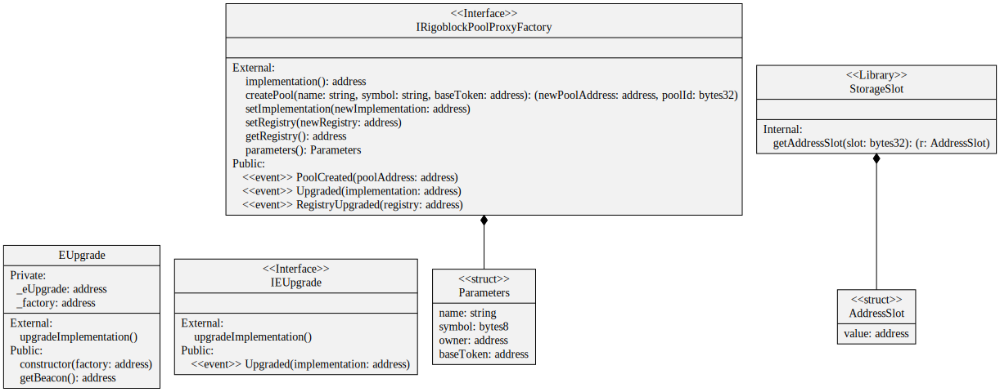

# EUpgrade

An upgrade is executed by the pool operator calling the upgrade method. The upgraded implementation address is returned by the beacon, which address is stored in the EUpgrade contract bytecode as deployment immutable. The proxy factory is used as the beacon, allowing for potentially different factories using different implementations.&#x20;

<figure><figcaption>
Credits: UML diagram generated with <a href="https://github.com/naddison36/sol2uml">SOL2UML</a>
</figcaption></figure>
