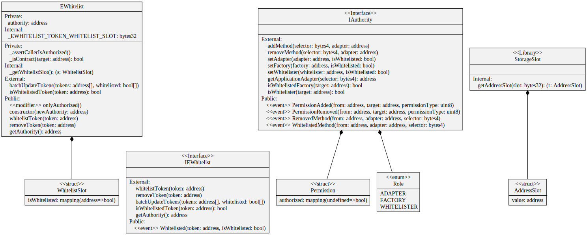

# EWhitelist

A token whitelist is used to prevent pool operator abuse by operating with rogue tokens, EOAs as a transaction's target. While this makes a DeFi transaction slightly more expensive in terms of gas, it provides security benefits to the pool holders.

As a rule of thumb, any token that has a decent reputation will be whitelisted.

<figure><figcaption>
Credits: UML diagram generated with <a href="https://github.com/naddison36/sol2uml">SOL2UML</a>
</figcaption></figure>
