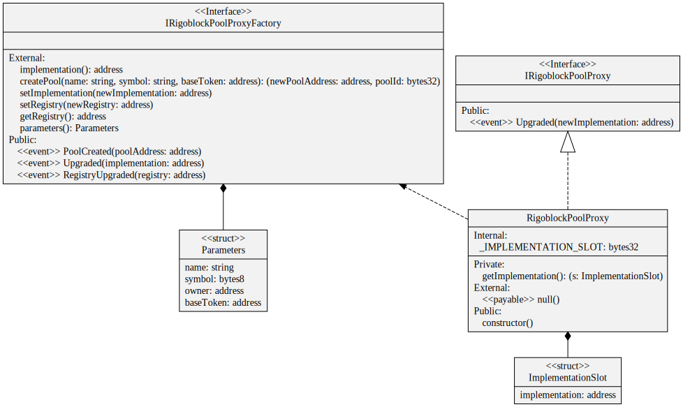

# proxy

RigoBlock proxies are ultra-light contracts developed according EIP1967 that only declare \_IMPLEMENTATION\_SLOT in their storage, where the implementation address is stored. At contract creation, the initialization storage slots are written to the proxy storage at a deterministic slot which, by design, will never accidentally clash with other variables.&#x20;

<figure><figcaption>
Credits: UML diagram generated with <a href="https://github.com/naddison36/sol2uml">SOL2UML</a>
</figcaption></figure>
