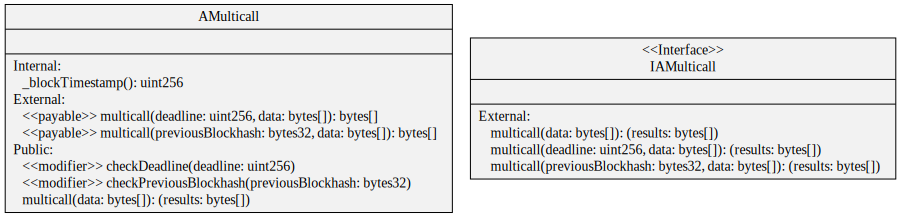

# AMulticall

Batches of transactions sent in multicall format are forwarded to the proxy and executed individually, requiring individual methods' sanity checks to be successful before the call can be executed.

<figure><figcaption>
Credits: UML diagram generated with <a href="https://github.com/naddison36/sol2uml">SOL2UML</a>
</figcaption></figure>
