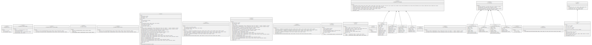

# AUniswap

Transactions to Uniswap are handled by a custom adapter, which makes some sanity checks and then sends a swap/mint/burn op to the Uniswap V2 router, which includes methods for Uniswap V3, V2, NPM.

Being RigoBlock oracle-agnostic, slippage protection against a market's best price cannot be offered at a protocol level at the moment. A pool operator can set slippage protection parameters which will be enforced on-chain at runtime, however, nothing prevents a pool operator from sending a rogue transaction to his operated pool. A possible attack involves the smart contract pool operator using the pool's tokens to move a whitelisted token price on a just created illiquid pair, at the same borrowing the same token from the owner smart contract, selling the token on the same pair, and returning the borrowed tokens for a profit. In the same way, a pool operator may send token swap transactions by selecting a pair where the pool operator is the only liquidity provider, therefore charging the pool unnecessary swap fees. This is a known limitation of the RigoBlock protocol and possible improvements are being researched. It is therefore not advisable to mint tokens of anonymous pools and pools that do not have clear Terms\&Conditions they abide by.

<figure><figcaption>
Credits: UML diagram generated with <a href="https://github.com/naddison36/sol2uml">SOL2UML</a>
</figcaption></figure>
